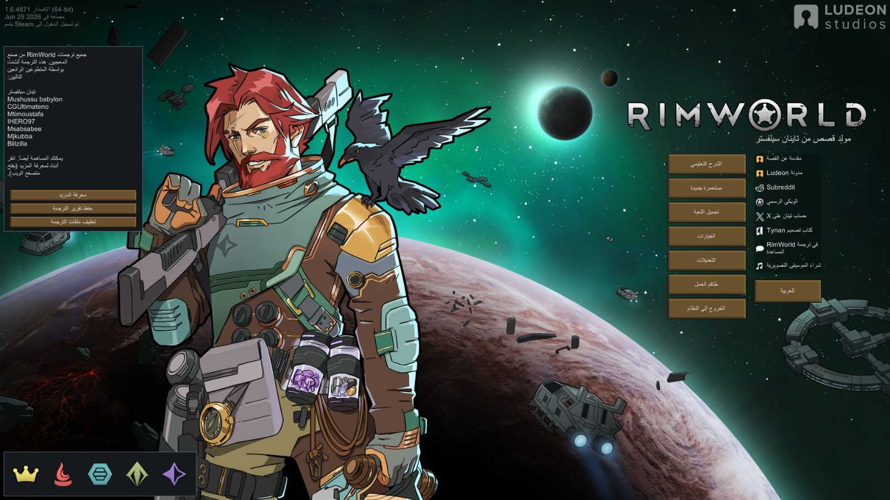
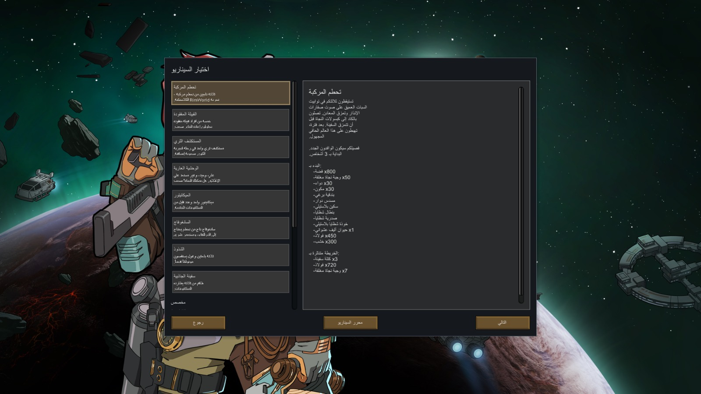
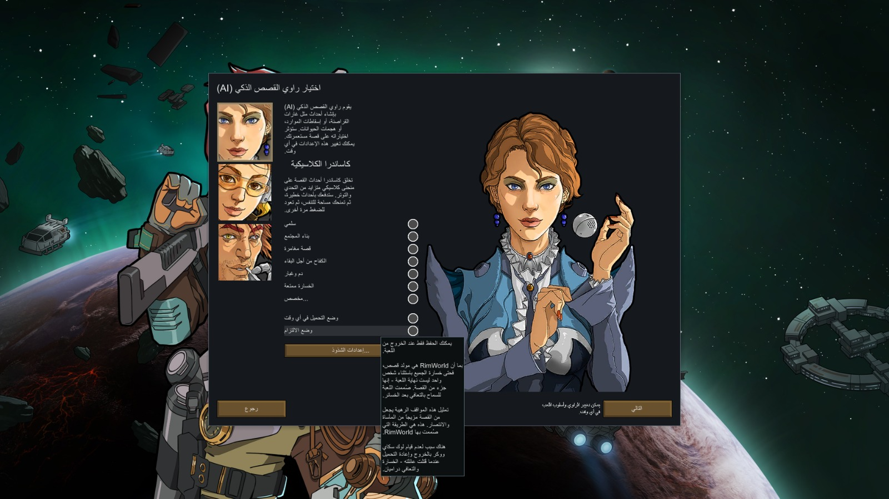
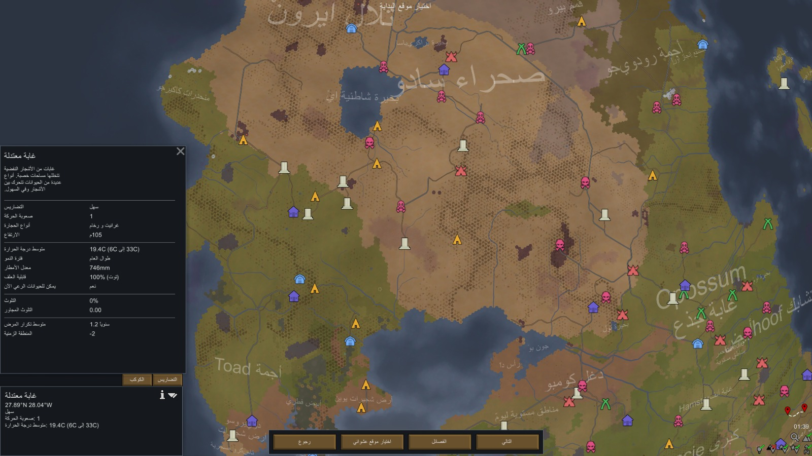
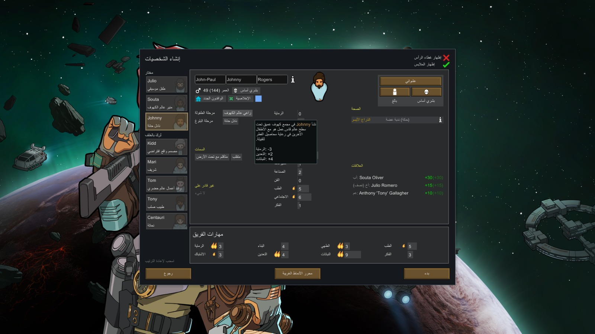
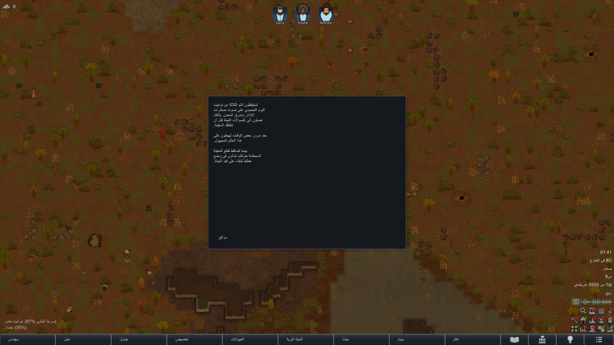
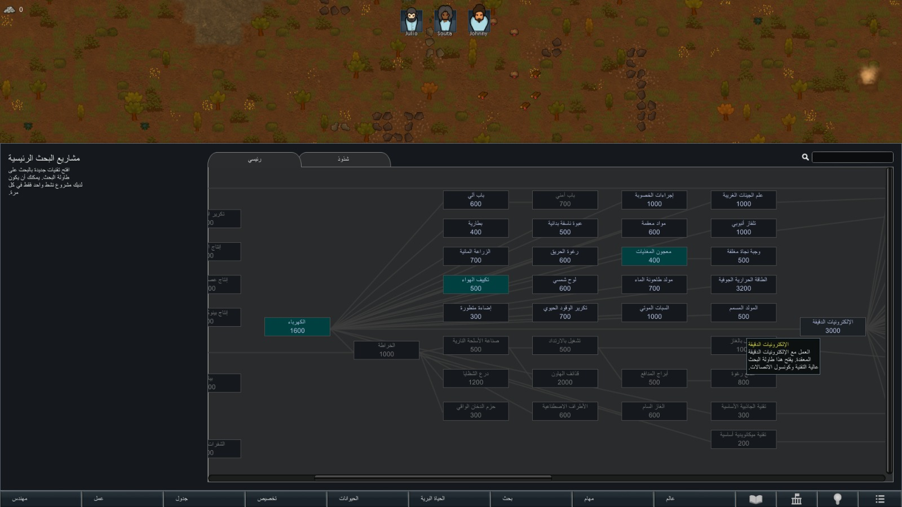
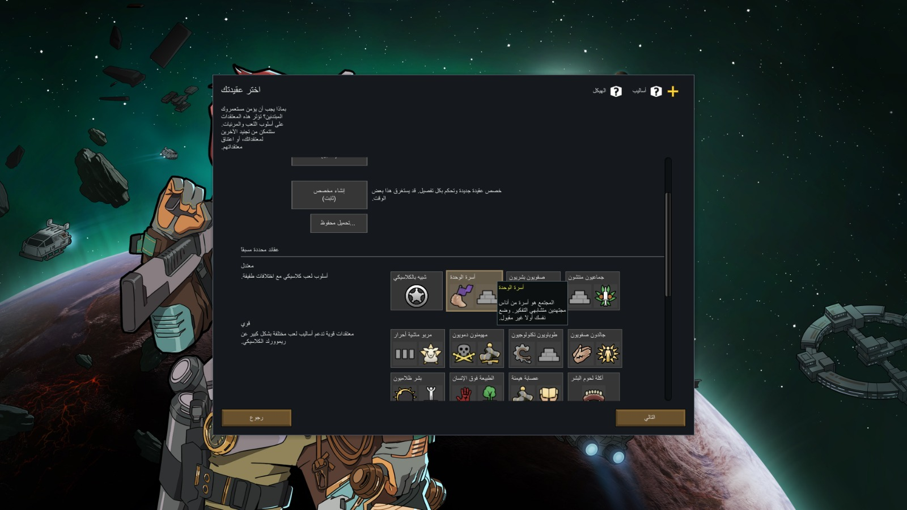

# RimWorld Arabic Translation Mod | تعريب لعبة ريمورلد

تعريب متكامل للعبة **RimWorld** يشمل اللعبة الأساسية وجميع الإضافات (**DLCs**).

> **ملاحظة:** إذا واجهت أي أخطاء أو ترجمة غير دقيقة، نرجو منك المساهمة في تحسينها عبر **"قواعد المشاركة"** الموضحة في الأسفل.

---

## 📸 لقطات من داخل اللعبة (Screenshots)

 

 

 

 

 

 

 

 

---

## 🚀 طريقة التثبيت (Installation)

**الشرح:**
1. **حمل المود**
2. **انسخ مجلد `Arabic_MOD` وألصقه داخل مجلد اللعبة الرئيسي (`Mods`)**
   

### 1. نسخة Steam 🎮
المسار الافتراضي:
`C:\Program Files (x86)\Steam\steamapps\common\RimWorld\Mods`

### 2. نسخة GOG 📂
المسار الافتراضي:
`C:\GOG Games\RimWorld\Mods`

---

## 👤 المترجم (Translator)
## Current 2026

**Mushussu Babylon**
**MASS NSEN**

## تم تحويلها لمود من قبل 
**MASS NSEN**

---

## 📜 قواعد المشاركة (Contribution Rules)

للحفاظ على استقرار المشروع، يرجى اتباع الإرشادات التالية عند الرغبة في المشاركة:

**1.القيام بـpull request:** يرجى توفير شرح للنص الذي ستغيره أو تضيفه.

  **2.فتح Issue:** لتحسين أي نص، يرجى فتح **Issue** جديد، مع تزويدنا بما يلي:
   
**النص الحالي المراد تغييره.**
   
**النص المقترح البديل.**
   
**صورة توضح مكان النص في اللعبة.**

  *سيتم مراجعة كافة الاقتراحات وتحديث التعريب بشكل تلقائي كل اسبوع يوم الجمعة أو عند الحاجة للتحديث.*

---
**شكراً لدعمكم لهذا المشروع!**
