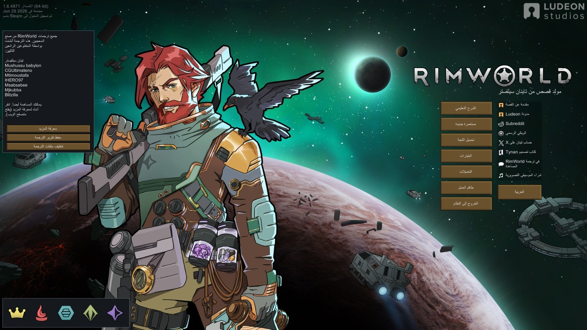
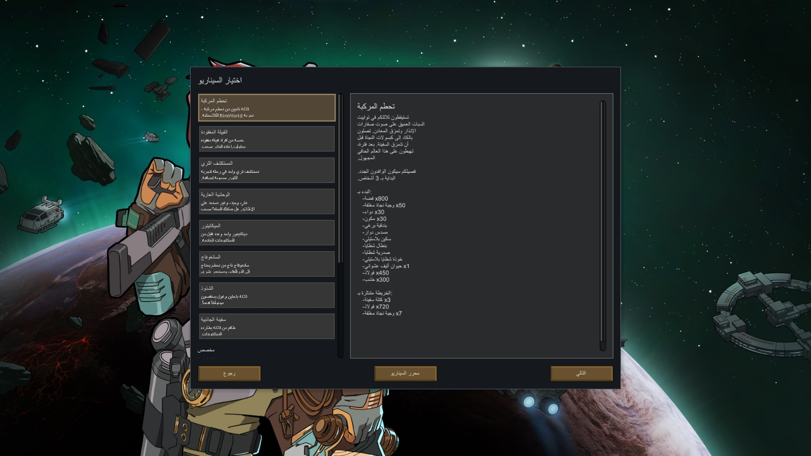
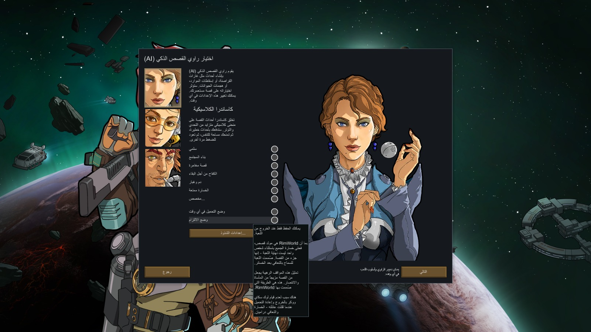
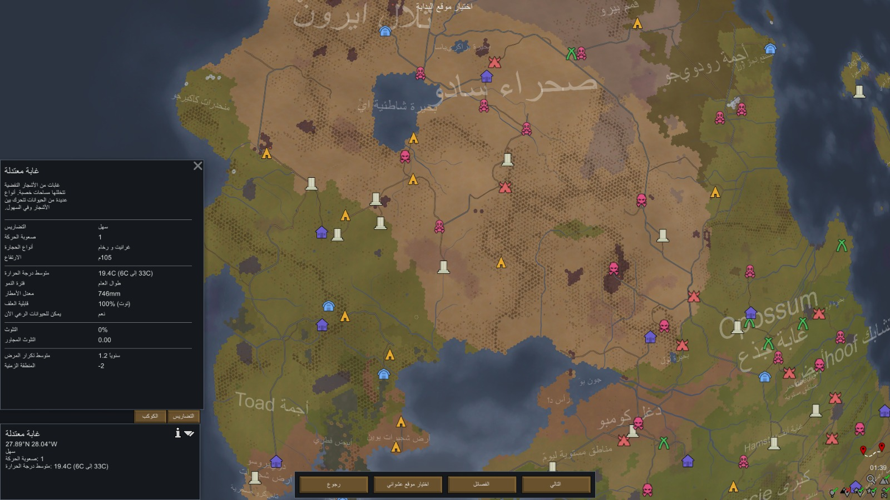
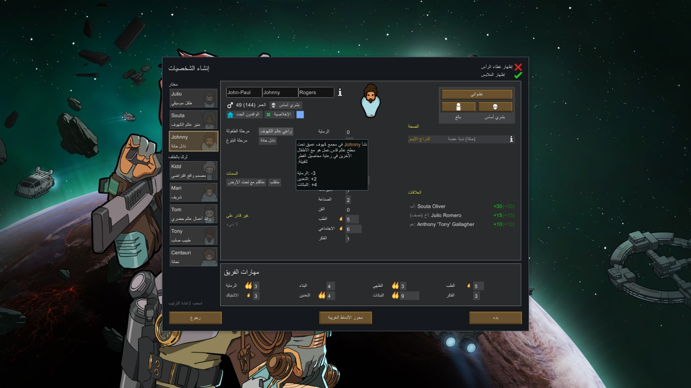
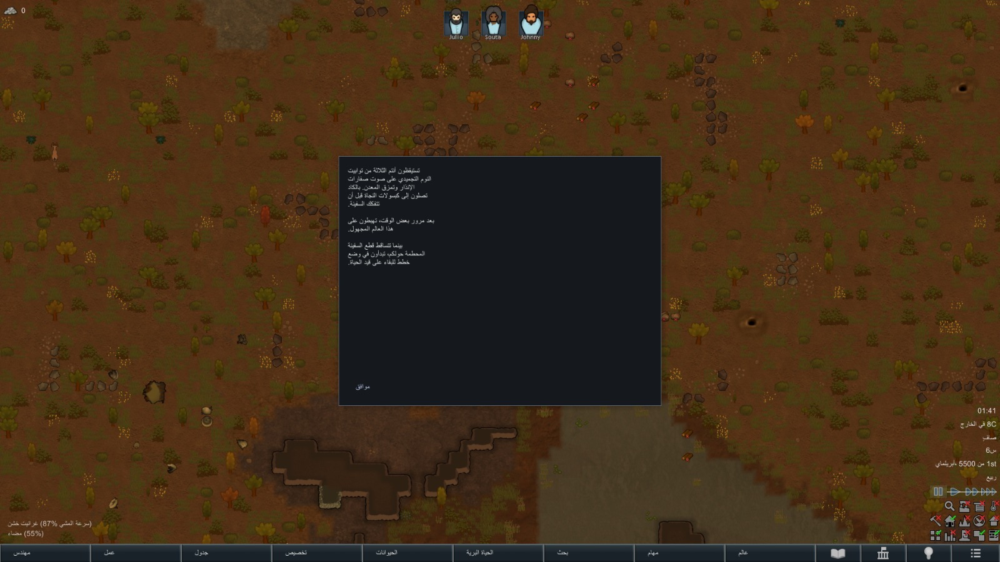
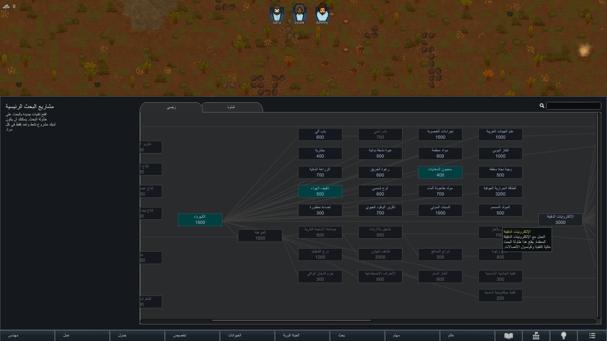
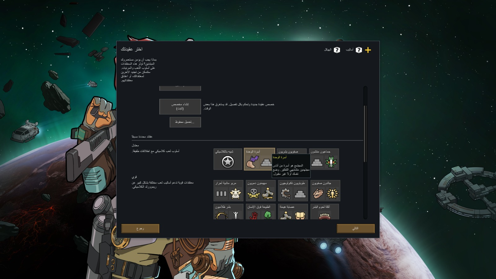

# RimWorld Arabic Translation | تعريب لعبة ريمورلد

تعريب متكامل للعبة **RimWorld** يشمل اللعبة الأساسية وجميع الإضافات (**DLCs**).

> **ملاحظة:** إذا واجهت أي أخطاء أو ترجمة غير دقيقة، نرجو منك المساهمة في تحسينها عبر **"قواعد المشاركة"** الموضحة في الأسفل.

---

## 📸 لقطات من داخل اللعبة (Screenshots)

 

 

 

 

 

 

 

 

---

## 🛠️ نسخ التعريب المتاحة (Releases)

**بسبب القيود التقنية في محرك اللعبة فيما يخص اللغة العربية (RTL)، تم توفير ثلاث نسخ حسب الرغبة:**
1. **نسخة Data-WordWrap** : التعريب يظهر بحروف متصلة و تستطيع أن تقرأ من الأعلى إلى الأسفل لكن الكلمات تتجمع في الجهة اليسرى.
2. **نسخة Data-Normal** : التعريب يظهر بحروف متصلة مع طول نصوص طبيعي لكن يجب أن تقرأ النصوص من الأسفل إلى الأعلى.
3. **نسخة Data-ArabicSupport** : التعريب يظهر بحروف متصلة و يأتي هذا التعريب مع مود (`ArabicSupport`) ليجعل النصوص تُقرأ من الأعلى إلى الأسفل مع طول نصوص طبيعي.

### ✨ مميزات مود ArabicSupport الجديدة:
- **دعم كتابة الحروف العربية:** يمكنك الآن كتابة الحروف العربية مباشرة داخل اللعبة.
- **دعم الخطوط المخصصة:** يمكنك تغيير خط اللعبة إلى أي خط عربي تفضله. الخط الافتراضي هو **Cairo Bold**.
- **طريقة تغيير الخط:**
  1. اذهب إلى مجلد الخطوط الإضافية في المستودع: **[مجلد ExtraFonts/Fonts](https://github.com/MushussuBabylon/ArabicSupport/tree/main/ExtraFonts/Fonts)**
  2. قم بتحميل ملف الخط (`.fontbundle`) الذي تحتاجه.
  3. الصق ملف الخط الذي تم تحميله داخل مجلد الخطوط الرئيسي للمود: **[مجلد Fonts](https://github.com/MushussuBabylon/ArabicSupport/tree/main/Fonts)** (مع استبدال الملفات الموجودة أو الإضافة إليها).

> **ملاحظة:** يمكنك تصفح قائمة الخطوط المتاحة كاملة داخل مجلد **[ExtraFonts](https://github.com/MushussuBabylon/ArabicSupport/tree/main/ExtraFonts)** حيث يوجد أكثر من 77 نمط خط جاهز للاستخدام.

---

## 🚀 طريقة التثبيت (Installation)

**الشرح:**
1. **حمّل النسخة المناسبة**
2. **فك ضغط ملف الـ `ZIP` وألصقه داخل مجلد اللعبة الرئيسي (`RimWorld`)**
3. **في حال كنت تستخدم نسخة Data-ArabicSupport، فقط قم بفك الضغط وسيتم لصق المجلدات في المكان الصحيح (الترجمة و المود)**
   
### 1. نسخة Steam 🎮  
المسار الافتراضي:  
`C:\Program Files (x86)\Steam\steamapps\common\RimWorld`

### 2. نسخة GOG 📂  
المسار الافتراضي:  
`C:\GOG Games\RimWorld`

---

## 👤 المترجم (Translator)
 **Current 2026**

★ Mushussu Babylon

---

# NexusMods
[Page link](https://www.nexusmods.com/rimworld/mods/757)

---

## 📜 قواعد المشاركة (Contribution Rules)

للحفاظ على استقرار المشروع، يرجى اتباع الإرشادات التالية عند الرغبة في المشاركة:

**1. القيام بـ pull request:** يرجى توفير شرح للنص الذي ستغيره أو تضيفه.

**2. فتح Issue:** لتحسين أي نص، يرجى فتح **Issue** جديد، مع تزويدنا بما يلي:
     
**النص الحالي المراد تغييره.**
     
**النص المقترح البديل.**
     
**صورة توضح مكان النص في اللعبة.**

  *سيتم مراجعة كافة الاقتراحات وتحديث التعريب بشكل تلقائي كل أسبوع يوم الجمعة أو عند الحاجة للتحديث.*

---
**شكراً لدعمكم لهذا المشروع!**
